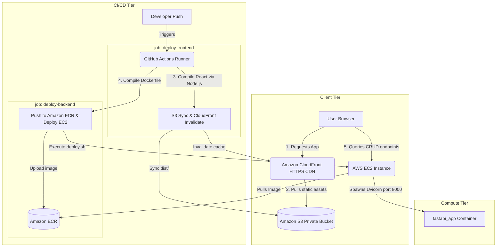
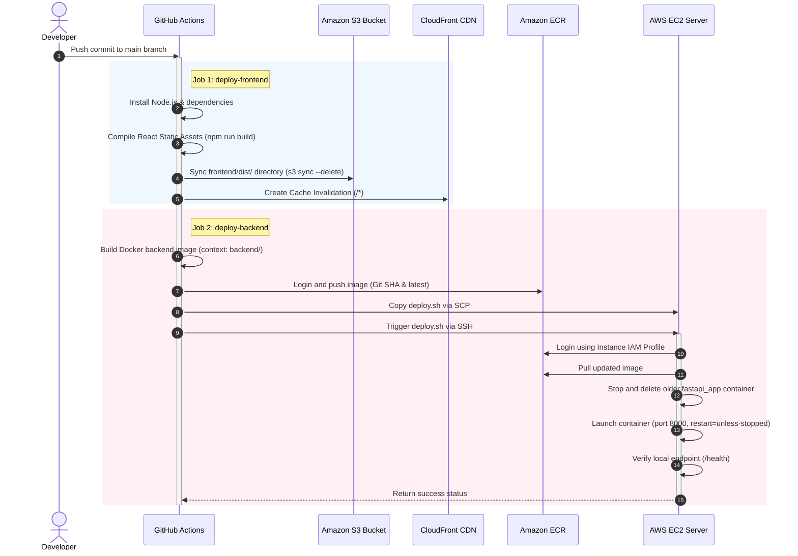

# Full-Stack CI/CD Pipeline using GitHub Actions, Docker, S3, CloudFront, ECR & EC2

## Project Title
**Production-Grade GitOps: Static React Frontend Deployed on AWS S3 & CloudFront, with Multi-Stage FastAPI Docker Backend on ECR & EC2 via Parallel GitHub Actions Workflows**

---

## 1. Goal & Architecture Overview

This project implements a secure, fully automated production-style GitOps deployment. 
1. **Frontend:** A React web application utilizing Node.js for bundling and compilation. It is hosted on Amazon S3 and distributed via Amazon CloudFront (CDN) for low-latency delivery. Access to the S3 bucket is restricted exclusively to CloudFront via **Origin Access Control (OAC)** to ensure data security.
2. **Backend:** A containerized Python FastAPI application running on an AWS EC2 instance. It handles CRUD and health API operations, and is exposed via a secure Docker container behind port `8000`.
3. **CI/CD Pipeline:** A parallelized GitHub Actions workflow triggers upon git pushes to the `main` branch. It compiles the Node.js frontend and syncs static files to S3, invalidates the CloudFront cache, and concurrently builds/tags/pushes the Docker backend to Amazon ECR, followed by remote deployment orchestration on EC2 via SSH.

### System Architecture Diagram


### CI/CD Workflow Sequence Diagram


---

## 2. Workspace Directory Layout

```
project/
├── .github/
│   └── workflows/
│       └── deploy.yml          # [workflows/deploy.yml]( CICD%20project/.github/workflows/deploy.yml) - Dual-job CI/CD pipeline
├── backend/
│   ├── app/
│   │   ├── main.py             # [backend/app/main.py]( CICD%20project/backend/app/main.py) - Uvicorn main + CORS configuration
│   │   ├── routes.py           # [backend/app/routes.py]( CICD%20project/backend/app/routes.py) - Mock task db CRUD routes
│   │   └── requirements.txt    # [backend/app/requirements.txt]( CICD%20project/backend/app/requirements.txt) - FastAPI dependencies
│   ├── Dockerfile              # [backend/Dockerfile]( CICD%20project/backend/Dockerfile) - Multi-stage container file
│   ├── .dockerignore           # [backend/.dockerignore]( CICD%20project/backend/.dockerignore) - Excluded container files
│   └── docker-compose.yml      # [backend/docker-compose.yml]( CICD%20project/backend/docker-compose.yml) - Backend local orchestration
├── frontend/
│   ├── src/
│   │   ├── App.jsx             # [frontend/src/App.jsx]( CICD%20project/frontend/src/App.jsx) - React dynamic client
│   │   ├── App.css             # [frontend/src/App.css]( CICD%20project/frontend/src/App.css) - Panel styles
│   │   ├── index.css           # [frontend/src/index.css]( CICD%20project/frontend/src/index.css) - Palette setup
│   │   └── main.jsx            # [frontend/src/main.jsx]( CICD%20project/frontend/src/main.jsx) - React DOM mounting
│   ├── index.html              # [frontend/index.html]( CICD%20project/frontend/index.html) - Main layout
│   ├── package.json            # [frontend/package.json]( CICD%20project/frontend/package.json) - Node.js scripts
│   └── vite.config.js          # [frontend/vite.config.js]( CICD%20project/frontend/vite.config.js) - Bundler configurations
├── scripts/
│   └── deploy.sh               # [scripts/deploy.sh]( CICD%20project/scripts/deploy.sh) - Remote shell container runner
├── screenshots/
│   └── README.md               # [screenshots/README.md]( CICD%20project/screenshots/README.md) - Screenshot evidence checklist
├── .gitignore                  # [.gitignore]( CICD%20project/.gitignore) - Git exclusion list
└── README.md                   # [README.md]( CICD%20project/README.md) - Master documentation (this file)
```

---

## 3. Local Installation & Testing

You can run both the frontend and backend locally to test interactions before pushing to AWS.

### 3.1 Run FastAPI Backend
1. Navigate to the `backend/` folder:
   ```bash
   cd backend
   ```
2. Create and activate a virtual environment:
   ```bash
   python -m venv .venv
   # On Windows:
   .venv\Scripts\activate
   # On macOS/Linux:
   source .venv/bin/activate
   ```
3. Install dependencies:
   ```bash
   pip install -r app/requirements.txt
   ```
4. Start the server using Uvicorn (run from the `backend/` directory to preserve package search context):
   ```bash
   uvicorn app.main:app --host 0.0.0.0 --port 8000 --reload
   ```

### 3.2 Run React Frontend
1. Open a new terminal and navigate to the `frontend/` folder:
   ```bash
   cd frontend
   ```
2. Install dependencies:
   ```bash
   npm install
   ```
3. Start the dev server:
   ```bash
   npm run dev
   ```
4. Open the displayed URL (typically `http://localhost:5173/`).

---

## 4. AWS Infrastructure Provisioning Guide

Follow these commands to configure the secure production AWS environment.

### 4.1 Set Up ECR Repository
Create the ECR repository to store your Docker images:
```bash
aws ecr create-repository \
    --repository-name devops-fastapi-app \
    --region ap-south-1 \
    --image-scanning-configuration scanOnPush=true \
    --encryption-configuration encryptionType=AES256
```

### 4.2 Create S3 Bucket for Frontend Hosting
1. Create the bucket (choose a unique bucket name):
   ```bash
   aws s3api create-bucket \
       --bucket devops-frontend-static-bucket \
       --region ap-south-1
   ```
2. Disable public access (we will configure CloudFront to access it privately):
   ```bash
   aws s3api put-public-access-block \
       --bucket devops-frontend-static-bucket \
       --public-access-block-configuration "BlockPublicAcls=true,IgnorePublicAcls=true,BlockPublicPolicy=true,RestrictPublicBuckets=true"
   ```

### 4.3 Configure S3 Bucket Policy for Origin Access Control (OAC)
CloudFront uses **Origin Access Control (OAC)** to fetch private assets from S3. Attach the following bucket policy.

#### Save as `s3-bucket-policy.json`
*(Replace `devops-frontend-static-bucket`, `123456789012`, and `E3XXXXXXXXXXXX` with your actual S3 bucket name, AWS Account ID, and CloudFront Distribution ID respectively)*:
```json
{
    "Version": "2012-10-17",
    "Statement": [
        {
            "Sid": "AllowCloudFrontServicePrincipalReadOnly",
            "Effect": "Allow",
            "Principal": {
                "Service": "cloudfront.amazonaws.com"
            },
            "Action": "s3:GetObject",
            "Resource": "arn:aws:s3:::devops-frontend-static-bucket/*",
            "Condition": {
                "StringEquals": {
                    "AWS:SourceArn": "arn:aws:cloudfront::123456789012:distribution/E3XXXXXXXXXXXX"
                }
            }
        }
    ]
}
```
Apply the policy to the bucket:
```bash
aws s3api put-bucket-policy \
    --bucket devops-frontend-static-bucket \
    --policy file://s3-bucket-policy.json
```

### 4.4 Configure AWS CloudFront Distribution
Configure a CloudFront Web Distribution using the AWS Management Console or AWS CLI:
* **Origin domain:** Select your S3 bucket.
* **Origin access:** Select "Origin access control settings (recommended)" and create a control setting with signature behavior set to "Sign requests".
* **Default cache behavior:** Redirect HTTP to HTTPS.
* **Default root object:** `index.html`.

### 4.5 Launch EC2 Instance & IAM Role Configuration
Follow sections `6.2`, `6.3`, `6.4`, and `6.5` in your initial workflow guide to create the EC2 security group, configure the `EC2-ECR-ReadOnly-Role` IAM Instance Profile, launch the Ubuntu EC2 server, and install Docker, AWS CLI, and Git.

---

## 5. GitHub Repository Secrets Setup

Navigate to your GitHub repository -> **Settings** -> **Secrets and variables** -> **Actions** -> **New repository secret** and configure the following 10 secrets:

| Secret Name | Description / Example Value |
| :--- | :--- |
| `AWS_ACCESS_KEY_ID` | IAM User access key (must have permission to push to ECR, sync to S3, and invalidate CloudFront). |
| `AWS_SECRET_ACCESS_KEY` | IAM User secret access key. |
| `AWS_REGION` | AWS region of your infrastructure (e.g. `ap-south-1`). |
| `AWS_ACCOUNT_ID` | Your 12-digit AWS Account ID. |
| `ECR_REPOSITORY` | ECR repository name (e.g. `devops-fastapi-app`). |
| `EC2_HOST` | Public IP or DNS of the backend EC2 server. |
| `EC2_USERNAME` | OS user for SSH authentication (e.g. `ubuntu`). |
| `SSH_PRIVATE_KEY` | SSH Private Key content (`.pem` file). |
| `AWS_S3_BUCKET` | The target S3 Bucket name (e.g. `devops-frontend-static-bucket`). |
| `CLOUDFRONT_DISTRIBUTION_ID` | CloudFront Distribution ID (e.g. `E2XXXXXXXXXX`). |

---

## 6. Live Endpoint Verification

Once the GitHub Actions workflow runs successfully and turns green, verify your deployment:

1. **Access the Frontend URL:**
   Open a browser and go to your CloudFront distribution domain name (e.g. `https://d123456789.cloudfront.net`).
2. **Access the Backend API:**
   Verify the API is running by navigating to `http://<YOUR-EC2-PUBLIC-IP>:8000/health`.
3. **Connect Frontend to Backend:**
   In the top-right configuration input box of the CloudFront dashboard, enter the backend IP URL: `http://<YOUR-EC2-PUBLIC-IP>:8000` and click **Apply**.
   *Test CRUD tasks (Add Task, Delete Task, Status checks) to verify connectivity.*

---

## 7. Common Deployment Errors & Solutions

### 7.1 CloudFront AccessDenied Error (403)
* **Cause:** The S3 bucket policy is blocking CloudFront access, or the S3 default root object is not set to `index.html` on CloudFront.
* **Fix:** Verify the S3 bucket policy matches section `4.3`, and ensure the CloudFront distribution configuration has `index.html` set as its "Default root object".

### 7.2 CORS Blocks in Browser console (`Access-Control-Allow-Origin` missing)
* **Cause:** The FastAPI backend does not permit cross-origin requests from the CloudFront HTTPS domain name.
* **Fix:** Ensure CORS configurations are registered in [main.py]( CICD%20project/backend/app/main.py). For testing, allow `allow_origins=["*"]`. For production hardening, restrict it to `allow_origins=["https://<YOUR-DISTRIBUTION-ID>.cloudfront.net"]`.

### 7.3 `AccessDenied` when performing `s3 sync` or `create-invalidation`
* **Cause:** The IAM user credentials configured in GitHub Secrets do not have the required permissions for S3 and CloudFront actions.
* **Fix:** Attach a policy granting `s3:PutObject`, `s3:GetObject`, `s3:DeleteObject`, `s3:ListBucket`, and `cloudfront:CreateInvalidation` to your GitHub Actions deployer IAM user.

---

## 8. Portfolio & Resume Resources

### ATS-Friendly Project Bullet Points
```
* Designed and deployed a secure, automated CI/CD pipeline using GitHub Actions, parallelizing frontend and backend build tasks to reduce release cycles to zero.
* Deployed a React Single-Page Application (SPA) on Amazon S3 and served it globally via CloudFront CDN, configuring Origin Access Control (OAC) to restrict bucket access.
* Containerized a FastAPI backend using a multi-stage Dockerfile, reducing final image footprint by 75% and removing build-time packages to secure the container runtime.
* Automated server-side updates on AWS EC2 via SSH bash scripting, integrating ECR authentication, container lifecycle controls, and endpoint health validation loops.
* Configured secure AWS access policies using IAM Instance Profiles on EC2, replacing hardcoded credentials with short-lived, auto-rotating IAM keys.
```

### Resume Project Summary
> **Multi-Tier GitOps CI/CD Pipeline (GitHub Actions, React, Node.js, Docker, S3, CloudFront, ECR, EC2)**
> Designed and built a secure, automated full-stack GitOps CI/CD pipeline. The frontend is a React application built with Node.js, hosted on Amazon S3, and served via CloudFront utilizing Origin Access Control (OAC) for secure asset delivery. The backend is a FastAPI Docker container deployed on AWS EC2 behind Uvicorn. Parallel GitHub Actions jobs automate React compilation, asset syncing to S3, CloudFront invalidation, Docker backend building, and remote EC2 deployment via SSH with automated health verification.

### GitHub Repository Description
> 🚀 Full-stack GitOps CI/CD pipeline. React frontend built with Node.js, hosted on S3 and distributed via CloudFront CDN using OAC. FastAPI backend containerized with multi-stage Docker builds and deployed on EC2 via ECR and parallel GitHub Actions workflows.
