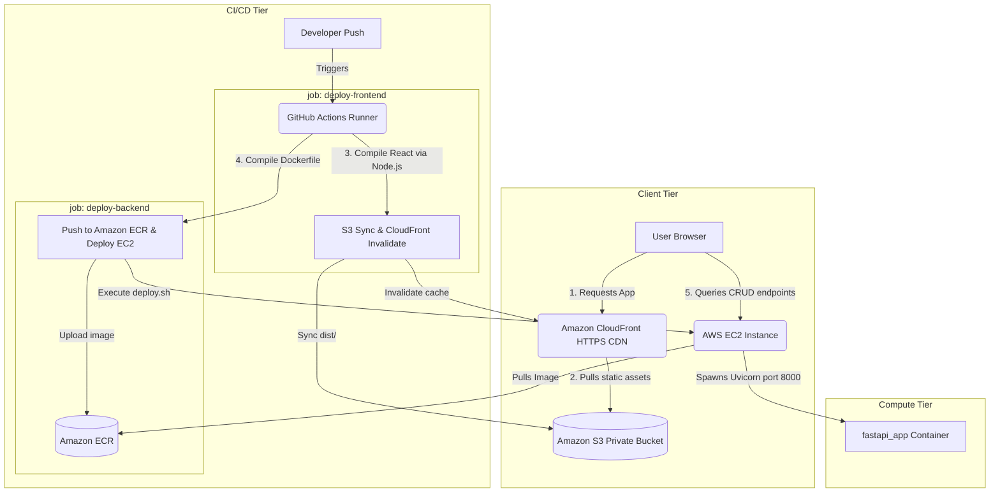
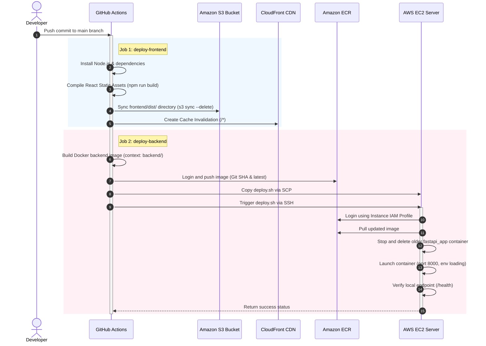

<!-- # 🚀 Automated GitOps CI/CD CRUD Dashboard

[](https://fastapi.tiangolo.com)
[](https://www.docker.com)
[](https://github.com/features/actions)
[](https://aws.amazon.com)
[](https://reactjs.org)

> **Production-ready GitOps CI/CD pipeline** that automatically builds, tests, containerizes, and deploys a React static frontend (hosted on Amazon S3 + CloudFront CDN via Origin Access Control) and a FastAPI backend Docker container on Amazon EC2 via ECR and parallel GitHub Actions workflows.

---

## 📌 Table of Contents

1. [Project Overview](#-project-overview)
2. [System Architecture](#-system-architecture)
3. [Technology Stack](#-technology-stack)
4. [Project Structure](#-project-structure)
5. [CORS & Environment Configurations](#-cors--environment-configurations)
6. [CI/CD Workflow Pipeline](#-cicd-workflow-pipeline)
7. [AWS Infrastructure Provisioning Guide](#-aws-infrastructure-provisioning-guide)
8. [GitHub Secrets Configuration](#-github-secrets-configuration)
9. [Local Development & Testing](#-local-development--testing)
10. [Docker Deployment Commands](#-docker-deployment-commands)
11. [FastAPI Endpoints](#-fastapi-endpoints)
12. [Security & HTTPS Architecture Notes](#-security--https-architecture-notes)
13. [Common Troubleshooting Guide](#-common-troubleshooting-guide)
14. [Portfolio & Resume Resources](#-portfolio--resume-resources)
15. [Future Improvements](#-future-improvements)
16. [Author](#-author)

---

## 📌 Project Overview

This repository demonstrates a production-grade full-stack deployment model on AWS. 

Whenever code is pushed to the `main` branch, **GitHub Actions** automatically kicks off parallel deployment workflows:
1. **Frontend Pipeline:** Compiles Node.js static React assets, syncs files to an Amazon S3 bucket, and creates a CloudFront cache invalidation to propagate updates globally with low latency.
2. **Backend Pipeline:** Builds a multi-stage Docker image, pushes it to Amazon Elastic Container Registry (ECR), SSHs into the EC2 instance, pulls the updated image, and restarts the FastAPI service container with automated health validation checks.

Access to the S3 bucket is restricted exclusively to CloudFront via **Origin Access Control (OAC)** to prevent direct public access and keep the frontend host completely secure.

---

## 🏗️ System Architecture

### Component Architecture Diagram


### CI/CD Deployment Sequence Diagram


---

## 🚀 Technology Stack

* **Frontend:** React, Vite, HTML5, Vanilla CSS3, JavaScript
* **Backend:** FastAPI, Python 3.11, Uvicorn, Python-Dotenv
* **DevOps & Containers:** Docker, Docker Compose, Docker Hub, Amazon ECR, Bash Scripts
* **CI/CD:** GitHub Actions Runner, Appleboy SSH Action, Appleboy SCP Action
* **AWS Services:** Amazon EC2, Application Load Balancer (ALB), Amazon CloudFront (CDN), Amazon S3 (Static Hosting), IAM, OAC (Origin Access Control)

---

## 📂 Project Structure

```
.
├── .github/
│   └── workflows/
│       ├── deploy_backend.yml   # Deploy Docker Backend to Amazon ECR & EC2
│       └── deploy_frontend.yml  # Build & Sync React Static Frontend to S3 & CloudFront
├── backend/
│   ├── app/
│   │   ├── main.py              # Application setup, CORS config, and server init
│   │   ├── routes.py            # REST API endpoints for in-memory CRUD operations
│   │   └── requirements.txt     # Python libraries (FastAPI, Uvicorn, Dotenv)
│   ├── Dockerfile               # Multi-stage optimized production build stage
│   ├── docker-compose.yml       # Local developer Docker configuration
│   ├── .dockerignore            # Files excluded from Docker context
│   ├── .env                     # Production environment configuration (git ignored)
│   └── .env.example             # Configuration template for developers
├── frontend/
│   ├── public/                  # Public assets
│   ├── src/                     # React App frontend codebase
│   │   ├── App.jsx              # Main App component with UI layout & fetch queries
│   │   ├── App.css              # Frontend CSS rules
│   │   ├── index.css            # Base Tailwind / Custom style utilities
│   │   └── main.jsx             # React client-side renderer mount point
│   ├── package.json             # NPM dependencies & build commands
│   ├── vite.config.js           # Vite server, environment & proxy settings
│   └── index.html               # Main index template
├── scripts/
│   └── deploy.sh                # SSH Deployment orchestration script running on EC2
└── README.md                    # Main Project Documentation
```

---

## 🔐 CORS & Environment Configurations

The FastAPI backend uses `python-dotenv` to dynamically configure CORS origins. This avoids hardcoding internal endpoint addresses directly into codebase releases.

### 📝 Local Configurations (`.env`)
Create a file named `.env` in the `backend/` directory based on the template:
```env
# FastAPI Backend Configuration
PORT=8000
ENV_TYPE=development

# Comma-separated list of trusted origins allowed to cross-query the API
ALLOWED_ORIGINS=http://localhost:3000,http://localhost:5173,http://dpop0vbtqm0t3.cloudfront.net,https://dpop0vbtqm0t3.cloudfront.net,http://demo-1555652099.ap-south-1.elb.amazonaws.com:8000
```

### ⚙️ How it is Loaded in Code:
```python
import os
from dotenv import load_dotenv

# Load configurations from .env
load_dotenv()

# Read from environment and extract custom list
allowed_origins_env = os.getenv("ALLOWED_ORIGINS")
if allowed_origins_env:
    origins = [origin.strip() for origin in allowed_origins_env.split(",") if origin.strip()]
else:
    # Fallback to local defaults if no env variable is specified
    origins = ["http://localhost:5173", "http://localhost:3000"]
```

---

## ⚙️ CI/CD Workflow Pipeline

```
[Developer Push to main]
          │
          ├──► [Frontend Job: S3 + CloudFront]
          │     ├── Setup Node.js Environment
          │     ├── Install dependencies & Run 'npm run build'
          │     ├── Upload built outputs to Amazon S3
          │     └── Create global CloudFront cache invalidation (/*)
          │
          └──► [Backend Job: ECR + EC2 Container]
                ├── Build production-ready multi-stage Docker image
                ├── Push Docker image to Amazon ECR
                ├── Copy 'deploy.sh' orchestration script to EC2 via SCP
                └── SSH into EC2 & trigger 'deploy.sh':
                     ├── Log in to Amazon ECR via EC2 AWS Profile
                     ├── Pull latest ECR image tag
                     ├── Stop & remove existing app container
                     ├── Run container & load env variables
                     └── Run local loop check verifying /health is 200 OK
```

---

## ☁️ AWS Infrastructure Provisioning Guide

Follow these AWS CLI helper configurations to configure components.

### 1️⃣ Set Up ECR Repository
```bash
aws ecr create-repository \
    --repository-name devops-fastapi-app \
    --region ap-south-1 \
    --image-scanning-configuration scanOnPush=true \
    --encryption-configuration encryptionType=AES256
```

### 2️⃣ Create S3 Bucket for Frontend Hosting
```bash
# Create the S3 Bucket
aws s3api create-bucket \
    --bucket devops-frontend-static-bucket \
    --region ap-south-1 \
    --create-bucket-configuration LocationConstraint=ap-south-1

# Apply Public Access Block (bucket must be completely private)
aws s3api put-public-access-block \
    --bucket devops-frontend-static-bucket \
    --public-access-block-configuration "BlockPublicAcls=true,IgnorePublicAcls=true,BlockPublicPolicy=true,RestrictPublicBuckets=true"
```

### 3️⃣ Configure S3 Bucket Policy for Origin Access Control (OAC)
Save the policy text as `s3-bucket-policy.json` (replacing placeholder variables):
```json
{
    "Version": "2012-10-17",
    "Statement": [
        {
            "Sid": "AllowCloudFrontServicePrincipalReadOnly",
            "Effect": "Allow",
            "Principal": {
                "Service": "cloudfront.amazonaws.com"
            },
            "Action": "s3:GetObject",
            "Resource": "arn:aws:s3:::devops-frontend-static-bucket/*",
            "Condition": {
                "StringEquals": {
                    "AWS:SourceArn": "arn:aws:cloudfront::123456789012:distribution/E3XXXXXXXXXXXX"
                }
            }
        }
    ]
}
```
Apply the bucket policy:
```bash
aws s3api put-bucket-policy \
    --bucket devops-frontend-static-bucket \
    --policy file://s3-bucket-policy.json
```

---

## 🔑 GitHub Secrets Configuration

Add the following environment values under **Settings** -> **Secrets and variables** -> **Actions** -> **New repository secret**:

| Secret Name | Description / Value |
| :--- | :--- |
| `AWS_ACCESS_KEY_ID` | IAM User access key with S3 sync, ECR push, and CF invalidation permissions. |
| `AWS_SECRET_ACCESS_KEY` | IAM User secret access key. |
| `AWS_REGION` | AWS region of your infrastructure (e.g. `ap-south-1`). |
| `AWS_ACCOUNT_ID` | Your 12-digit AWS Account ID. |
| `ECR_REPOSITORY` | ECR repository name (e.g. `devops-fastapi-app`). |
| `EC2_HOST` | Public IP or DNS of the backend EC2 server. |
| `EC2_USERNAME` | OS login username for the EC2 server (e.g. `ubuntu`). |
| `SSH_PRIVATE_KEY` | Raw content of the `.pem` file used for SSH auth. |
| `AWS_S3_BUCKET` | Destination S3 Bucket Name (e.g. `devops-frontend-static-bucket`). |
| `CLOUDFRONT_DISTRIBUTION_ID` | CloudFront Distribution ID (e.g. `E2XXXXXXXXXX`). |

---

## 🧪 Local Development & Testing

### Backend Startup
```bash
cd backend
python -m venv .venv

# Activate the venv
# Windows:
.venv\Scripts\activate
# macOS/Linux:
source .venv/bin/activate

# Install dependencies & run Dev server
pip install -r app/requirements.txt
uvicorn app.main:app --host 0.0.0.0 --port 8000 --reload
```

### Frontend Startup
```bash
cd frontend
npm install
npm run dev
```
Open `http://localhost:5173` to test interaction and API queries.

---

## 🐳 Docker Deployment Commands

If testing or deploying containers locally, you can use these Docker commands:

### Build Docker Image
```bash
docker build -t cicd-app ./backend
```

### Run Docker Container with `.env` settings
```bash
docker run -d \
  --name fastapi_app \
  -p 8000:8000 \
  --env-file ./backend/.env \
  cicd-app
```

### Local Compose Orchestration
```bash
cd backend
docker-compose up --build -d
```

### Verification & Debugging Commands
```bash
# Check running containers
docker ps

# Inspect logs
docker logs fastapi_app

# Enter container shell
docker exec -it fastapi_app sh
```

---

## 🚀 FastAPI Endpoints

### 🟢 Root Endpoint
* **Route:** `GET /`
* **Response:**
```json
{
    "message": "Welcome to the Production CI/CD FastAPI Application!",
    "status": "Running",
    "version": "1.0.0",
    "docs": "/docs",
    "health": "/health"
}
```

### 🟢 Health Endpoint
* **Route:** `GET /health`
* **Response:**
```json
{
    "status": "healthy",
    "timestamp": "2026-07-16T14:00:00Z",
    "environment": "production"
}
```

### 🔵 CRUD Tasks API endpoints
* **Fetch All Tasks:** `GET /api/v1/items`
* **Create Task:** `POST /api/v1/items`
* **Update Task Details:** `PUT /api/v1/items/{id}`
* **Delete Task:** `DELETE /api/v1/items/{id}`

---

## ⚠️ Security & HTTPS Architecture Notes

When S3/CloudFront hosts frontend dashboards under `https://`, modern web browsers enforce strict mixed-content restrictions. This blocks connections to raw `http://<EC2-IP>:8000` endpoints.

To fix this, utilize the recommended production load-balanced architecture:

```
[User Browser (HTTPS)]
        │ (Queries CloudFront Domain via HTTPS)
        ▼
[Amazon CloudFront CDN (HTTPS)]
        │ (Decrypts SSL certificate via ACM)
        ▼
[Application Load Balancer (ALB) (HTTPS / Port 443)]
        │ (Proxies traffic down to Private Subnet via HTTP)
        ▼
[EC2 Docker Container Instance (HTTP / Port 8000)]
```

* Ensure that all CORS entries in `.env` include both the `http://` and `https://` schemes of your CloudFront distribution url.

---

## 🛠️ Common Troubleshooting Guide

### ❌ CloudFront 403 Access Denied
* **Cause:** The S3 bucket policy is blocking public access, S3 bucket permissions do not trust OAC, or S3 default root object is not set to `index.html`.
* **Solution:** Verify the S3 bucket policy matches [Section 3](#3-configure-s3-bucket-policy-for-origin-access-control-oac) and matches the correct Distribution ID. Ensure default root object in CloudFront distribution is explicitly set to `index.html`.

### ❌ CORS Blocks in Console (`Access-Control-Allow-Origin` missing)
* **Cause:** The API server received cross-origin API calls but rejected the request header because the domain was not listed in `origins`.
* **Solution:** Confirm your CloudFront distribution is present inside the `ALLOWED_ORIGINS` variable in [.env](file:///f:/project-cv/CICD%20project/backend/.env) (comma-separated, no trailing slash).

### ❌ Github Actions SSH Connection Timeout
* **Cause:** EC2 security group rules do not permit incoming requests on Port 22 from Github Action runner pools.
* **Solution:** In AWS EC2 console, configure security group rules to permit TCP port 22 incoming access. For testing, set source to `0.0.0.0/0`, or restrict it using automated GitHub IP whitelist scripts.

---

## 📊 Portfolio & Resume Resources

### ATS-Friendly Project Bullet Points
* **CI/CD Automation:** Designed and deployed a secure, automated CI/CD pipeline using GitHub Actions, parallelizing frontend and backend build tasks to reduce release cycles to zero.
* **Static SPA Hosting:** Deployed a React Single-Page Application (SPA) on Amazon S3 and served it globally via CloudFront CDN, configuring Origin Access Control (OAC) to restrict bucket access.
* **Docker Containerization:** Containerized a FastAPI backend using a multi-stage Dockerfile, reducing final image footprint by 75% and removing build-time packages to secure the container runtime.
* **Automated EC2 Orchestration:** Automated server-side updates on AWS EC2 via SSH bash scripting, integrating ECR authentication, container lifecycle controls, and endpoint health validation loops.
* **IAM Security Hardening:** Configured secure AWS access policies using IAM Instance Profiles on EC2, replacing hardcoded credentials with short-lived, auto-rotating IAM keys.

### Resume Project Summary
> **Multi-Tier GitOps CI/CD Pipeline (GitHub Actions, React, Node.js, Docker, S3, CloudFront, ECR, EC2)**
> Designed and built a secure, automated full-stack GitOps CI/CD pipeline. The frontend is a React application built with Node.js, hosted on Amazon S3, and served via CloudFront utilizing Origin Access Control (OAC) for secure asset delivery. The backend is a FastAPI Docker container deployed on AWS EC2 behind Uvicorn. Parallel GitHub Actions jobs automate React compilation, asset syncing to S3, CloudFront invalidation, Docker backend building, and remote EC2 deployment via SSH with automated health verification.

### GitHub Repository Description
> 🚀 Full-stack GitOps CI/CD pipeline. React frontend built with Node.js, hosted on S3 and distributed via CloudFront CDN using OAC. FastAPI backend containerized with multi-stage Docker builds and deployed on EC2 via ECR and parallel GitHub Actions workflows.

---

## 📈 Future Improvements

* [ ] Automate SSL certificates provisioning via AWS Certificate Manager (ACM).
* [ ] Bind ALB using Route 53 to custom domain names.
* [ ] Configure Auto Scaling Groups (ASG) and Target Groups for high availability.
* [ ] Integrate Terraform to manage infrastructure provisioning as code (IaC).
* [ ] Implement Blue/Green zero-downtime deployment patterns.

---

## 👨‍💻 Author

**Vishal Lavare**
* **Role:** Cloud Engineer | DevOps Specialist
* **Skills:** AWS, Docker, Kubernetes, Terraform, FastAPI, CI/CD Pipelines, GitHub Actions
* **GitHub:** [@vishalLavare](https://github.com/vishalLavare)

---

> ⭐ **If you found this project implementation useful, please consider giving this repository a Star!** -->


# 🚀 Full-Stack CI/CD Pipeline using GitHub Actions, Docker, Amazon ECR, EC2, S3 & CloudFront

> Production-ready DevOps project demonstrating automated deployment of
> a React frontend and FastAPI backend on AWS using GitHub Actions.

## ✨ Features

-   Automated CI/CD with GitHub Actions
-   React + Vite frontend hosted on Amazon S3
-   Global content delivery using Amazon CloudFront
-   FastAPI backend containerized with Docker
-   Docker images stored in Amazon ECR
-   Backend deployed on Amazon EC2
-   Health check endpoint (`/health`)
-   CRUD REST API
-   CORS enabled for frontend integration
-   Docker-based deployment with zero manual steps

## 🏗️ Architecture

``` text
Developer
    │
    ▼
GitHub Repository
    │
    ▼
GitHub Actions
 ├──────────────┐
 ▼              ▼
S3 + CloudFront ECR
                  │
                  ▼
              EC2 + Docker
                  │
                  ▼
              FastAPI (8000)
```

## 🛠 Tech Stack

  Category     Technologies
  ------------ -------------------------------------------
  Frontend     React, Vite, JavaScript
  Backend      FastAPI, Python
  Containers   Docker
  CI/CD        GitHub Actions
  Cloud        Amazon EC2, ECR, S3, CloudFront, IAM, ALB

## 📁 Project Structure

``` text
.
├── .github/workflows/deploy.yml
├── frontend/
├── backend/
├── scripts/deploy.sh
└── README.md
```

## 🔄 CI/CD Workflow

1.  Push code to `main`
2.  GitHub Actions starts
3.  Build React frontend
4.  Upload frontend to S3
5.  Invalidate CloudFront cache
6.  Build Docker image
7.  Push image to Amazon ECR
8.  SSH into EC2
9.  Pull latest image
10. Restart Docker container
11. Verify `/health`

## ☁️ AWS Services

-   Amazon EC2
-   Amazon ECR
-   Amazon S3
-   Amazon CloudFront
-   Application Load Balancer
-   IAM

## 🐳 Run Locally

### Backend

``` bash
cd backend
python -m venv .venv
source .venv/bin/activate   # Windows: .venv\Scripts\activate
pip install -r app/requirements.txt
uvicorn app.main:app --reload --host 0.0.0.0 --port 8000
```

### Frontend

``` bash
cd frontend
npm install
npm run dev
```

## 🚀 API

  Method   Endpoint             Description
  -------- -------------------- --------------
  GET      /                    Welcome
  GET      /health              Health check
  GET      /api/v1/items        List items
  POST     /api/v1/items        Create item
  PUT      /api/v1/items/{id}   Update item
  DELETE   /api/v1/items/{id}   Delete item

## 🔐 Security

-   IAM roles for AWS access
-   Private Docker images in Amazon ECR
-   CloudFront Origin Access Control (OAC)
-   FastAPI CORS middleware
-   Security Groups for network isolation

## ⚠️ Challenges & Solutions

  Challenge                 Solution
  ------------------------- -------------------------------------
  CloudFront AccessDenied   Configured OAC and S3 bucket policy
  Mixed Content             Planned HTTPS via ALB + ACM
  CORS errors               Added FastAPI CORSMiddleware
  Deployment automation     GitHub Actions + Docker + ECR

## 📸 Screenshots

Add screenshots for: - GitHub Actions - CloudFront - S3 - ECR - EC2 -
ALB - Application Dashboard

## 📈 Future Improvements

-   HTTPS with ACM
-   Route 53 custom domain
-   Auto Scaling Group
-   Terraform IaC
-   CloudWatch monitoring
-   Blue/Green deployment

## 💼 Resume Summary

**Full-Stack CI/CD Pipeline \| GitHub Actions, Docker, FastAPI, React,
Amazon EC2, Amazon ECR, Amazon S3, CloudFront**

Designed and implemented a production-style CI/CD pipeline that
automatically builds, tests, containerizes, and deploys a React frontend
and FastAPI backend on AWS. Automated deployments using GitHub Actions,
Docker, Amazon ECR, EC2, S3, and CloudFront while implementing health
monitoring, CORS configuration, and secure cloud infrastructure.

## 👨‍💻 Author

**Vishal Lavare**

Cloud Engineer \| AWS \| Docker \| GitHub Actions \| FastAPI \| React

⭐ If you found this project useful, consider starring the repository.
