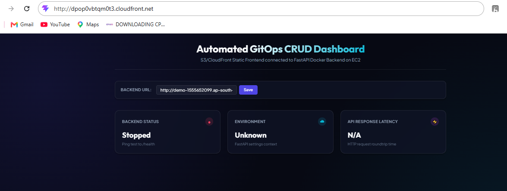
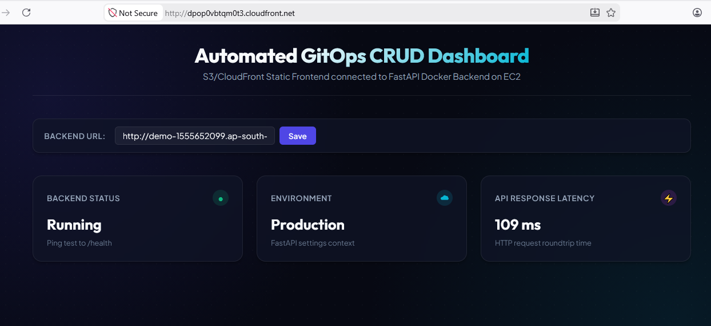

# 🚀 Production-Grade Full-Stack CI/CD Pipeline on AWS

<p align="center">


</p>

---

## 📖 Overview

This project demonstrates a **production-ready DevOps CI/CD pipeline** that automatically builds, tests, containerizes, and deploys a **React frontend** and **FastAPI backend** on AWS using **GitHub Actions**, **Docker**, **Amazon ECR**, **Amazon EC2**, **Amazon S3**, **Amazon CloudFront**, and **Application Load Balancer**.

Whenever code is pushed to the **main** branch, GitHub Actions automatically deploys both frontend and backend without manual intervention.

---

# 🏗️ Architecture

```text
                Developer
                    │
             Push to GitHub
                    │
                    ▼
            GitHub Actions CI/CD
          ┌──────────┴──────────┐
          │                     │
          ▼                     ▼
 Build React              Build Docker
          │                     │
          ▼                     ▼
     Amazon S3             Amazon ECR
          │                     │
          ▼                     ▼
   CloudFront CDN        Amazon EC2
          │                     │
          │              Docker Container
          │                     │
          └──────────────► Application Load Balancer
                               │
                               ▼
                          FastAPI Backend
```

---

# 🚀 Features

✅ Automated CI/CD using GitHub Actions

✅ Multi-stage Docker Build

✅ Amazon ECR Image Repository

✅ Automatic EC2 Deployment

✅ React Frontend on Amazon S3

✅ Global Content Delivery using CloudFront

✅ CRUD REST API using FastAPI

✅ Dockerized Backend

✅ Health Monitoring Endpoint

✅ Secure IAM-based AWS Authentication

✅ CORS Configuration

✅ Production Deployment Workflow

---

# 🛠 Technology Stack

| Category | Technologies |
|-----------|-------------|
| Frontend | React, Vite, JavaScript |
| Backend | FastAPI, Python |
| Containerization | Docker |
| CI/CD | GitHub Actions |
| Cloud | Amazon EC2, Amazon ECR, Amazon S3, CloudFront, ALB, IAM |

---

# ☁️ AWS Services Used

- Amazon EC2
- Amazon ECR
- Amazon S3
- Amazon CloudFront
- Application Load Balancer
- IAM
- Security Groups

---

# 📁 Project Structure

```text
.
├── .github/
│   └── workflows/
│       └── deploy.yml
│
├── backend/
│   ├── app/
│   ├── Dockerfile
│   └── requirements.txt
│
├── frontend/
│   ├── src/
│   ├── public/
│   ├── package.json
│   └── vite.config.js
│
├── scripts/
│   └── deploy.sh
│
└── README.md
```

---

# 🔄 CI/CD Workflow

```text
Git Push
    │
    ▼
GitHub Actions
    │
    ├───────────────┐
    │               │
    ▼               ▼
Build React    Build Docker
    │               │
    ▼               ▼
Upload S3      Push Amazon ECR
    │               │
Invalidate CDN       │
    │               ▼
    │          SSH to EC2
    │               │
    │         Pull Latest Image
    │               │
    │      Restart Docker Container
    │               │
    └──────────────► Health Check
```

---

# 🚀 REST API

| Method | Endpoint | Description |
|---------|----------|-------------|
| GET | / | Welcome API |
| GET | /health | Health Check |
| GET | /api/v1/items | List Items |
| POST | /api/v1/items | Create Item |
| PUT | /api/v1/items/{id} | Update Item |
| DELETE | /api/v1/items/{id} | Delete Item |

---

# 🐳 Run Locally

### Backend

```bash
cd backend
python -m venv .venv
pip install -r app/requirements.txt
uvicorn app.main:app --reload
```

### Frontend

```bash
cd frontend
npm install
npm run dev
```

---

# 🔐 Security

- IAM Role Authentication
- Docker Images stored in Amazon ECR
- Origin Access Control (OAC)
- FastAPI CORS Middleware
- Security Groups
- Docker Container Isolation

---

# ⚠️ Challenges Solved

| Problem | Solution |
|----------|----------|
| CloudFront 403 | Configured OAC + Bucket Policy |
| Mixed Content | Planned HTTPS ALB + ACM |
| CORS Issues | Configured CORSMiddleware |
| Docker Deployment | Automated using GitHub Actions |
| Zero Downtime Deployment | Automatic Container Restart |

---

# 📸 Screenshots

Dashboard (Backend Stopped) 
 

Dashboard (Backend Running) 
 

---

# 📈 Future Enhancements

- HTTPS using AWS Certificate Manager (ACM)
- Route 53 Custom Domain
- Auto Scaling Group
- Terraform Infrastructure as Code
- CloudWatch Monitoring
- Blue-Green Deployment
- AWS WAF Integration

---

# 💼 Resume Project Description

### Production-Grade Full-Stack CI/CD Pipeline on AWS

Designed and deployed a production-ready DevOps pipeline using **GitHub Actions**, **Docker**, **Amazon ECR**, **Amazon EC2**, **Amazon S3**, and **CloudFront**. Automated frontend and backend deployments with Docker containerization, health monitoring, secure IAM authentication, and cloud-native infrastructure, demonstrating end-to-end CI/CD and AWS deployment best practices.

---

# 👨‍💻 Author

**Vishal Lavare**

Cloud Engineer | AWS | Docker | GitHub Actions | FastAPI | React | CI/CD

---

⭐ **If you like this project, consider giving it a Star!**